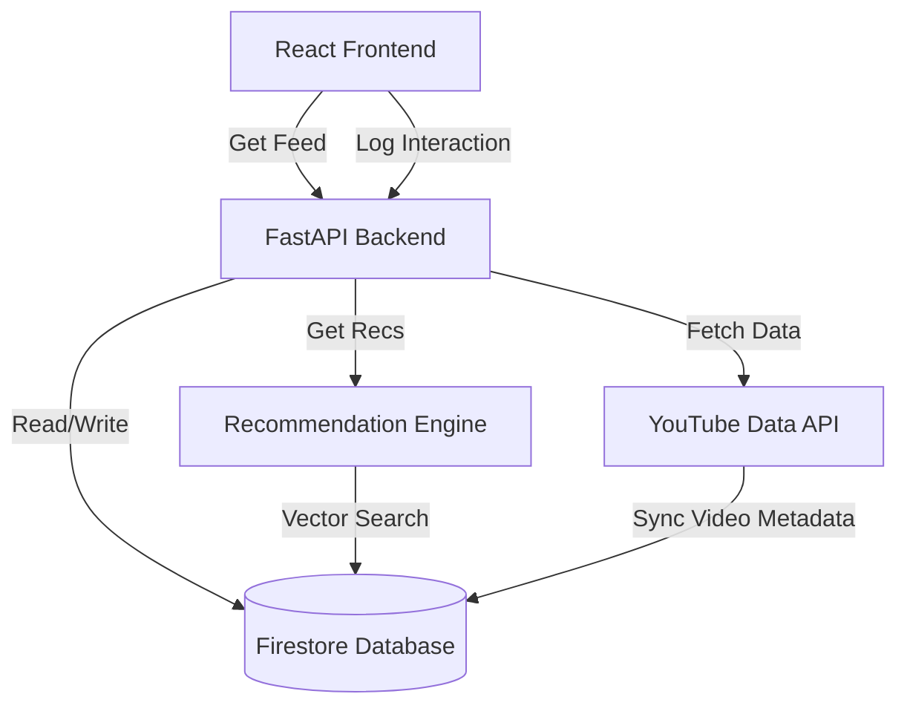

# Real-Time YouTube Recommendation Engine - System Architecture

## 1. High-Level Architecture
This system follows a **Microservices-ready** architecture using a decoupled Frontend and Backend, connected via RESTful APIs.

### **Diagram**

## 2. Tech Stack Decisions
*   **Frontend**: **React + Vite**. Chosen for speed and component reusability.
*   **Backend**: **FastAPI (Python)**. Chosen for native async support (high performance) and seamless integration with Python ML libraries (Scikit-Learn, Pandas).
*   **Database**: **Google Firestore**. Chosen over MongoDB/Postgres for this MVP because:
    *   It offers **Real-time listeners** out of the box.
    *   Schema-less design fits the variable metadata from YouTube API.
    *   Zero-config setup (Serverless).
*   **ML Engine**: **Hybrid Filtering**. Combines:
    1.  **Content-Based**: TF-IDF on video tags/titles.
    2.  **Collaborative/Behavioral**: User interaction history (clicks).
    3.  **Popularity**: View counts weighting.

## 3. Data Flow
1.  **Ingestion**: `db.py` syncs trending videos from YouTube API -> Firestore.
2.  **Interaction**: User clicks a video -> Frontend sends POST `/interaction` -> Backend logs to `interactions` collection.
3.  **Recommendation**:
    *   Backend fetches user history.
    *   Calculates "Interest Profile" (e.g., User likes "Gaming" 80%, "Music" 20%).
    *   Recommender scores all videos based on: `Similarity(Video, CurrentVideo) * 0.5 + UserInterest(Video) * 0.3 + Popularity * 0.2`.
    *   Returns sorted list.

## 4. Scalability & Security
*   **Keys**: API Keys are managed via environment variables (or secure JSON file).
*   **Rate Limiting**: Can be implemented via FastAPI dependency.
*   **Caching**: In-memory caching (LRU) used for ML vectors to prevent re-training on every request.
